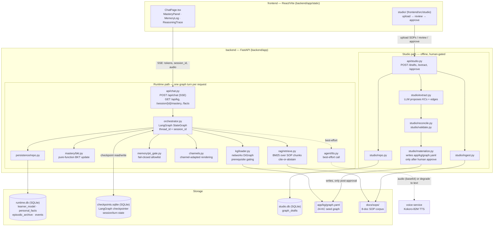
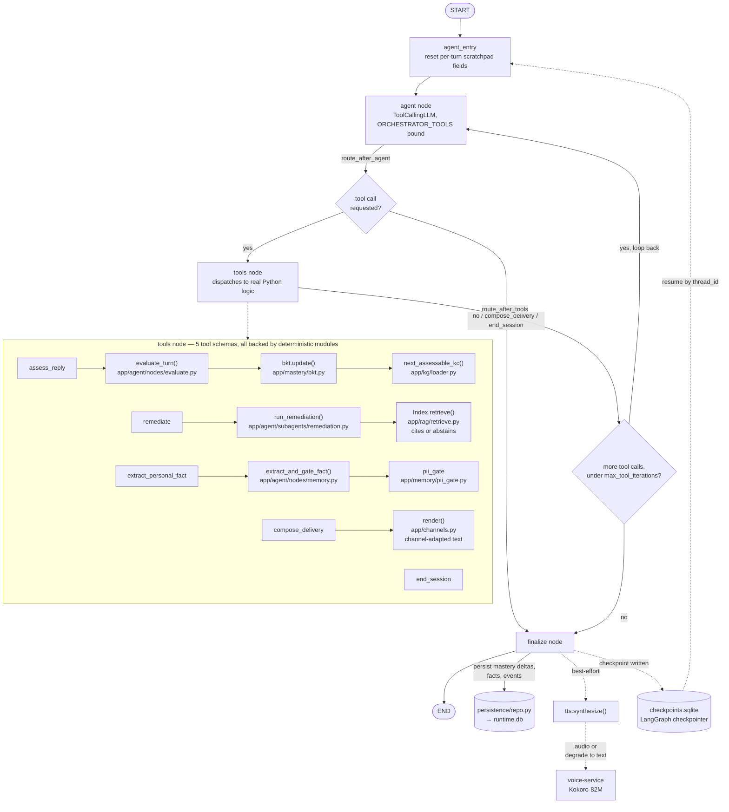

# hr-training-agentic-system — Sofía

Sofía is a training and assessment agent for frontline employees: a conversational agent that runs short adaptive assessments and micro-training sessions over chat or voice, maintains a per-employee mastery model over a role-specific skills graph, and emits structured competency and risk data. `docs/PRD.md` and `docs/VISION.md` contain the full product spec this repo implements.

## Problem

Frontline employers (logistics, retail, manufacturing) are legally required to train workers and keep them competent as SOPs, equipment, and regulations change. In practice: training happens once at induction and decays; LMS completion ("watched the video") correlates weakly with correct behavior; coverage is worst where turnover is highest (temp/seasonal staff); and a competence gap usually surfaces only after an incident.

Sofía replaces course-and-quiz completion tracking with per-skill, per-employee mastery estimates derived from short conversational check-ins on the channels workers already use. Effects:

- Higher completion/re-engagement: short, spaced check-ins on a personal device fit shift work better than scheduled classroom sessions or long e-learning modules.
- Competence visibility per employee per skill, instead of a completion checkbox.
- Remediation at the point of failure, with a citation to the source SOP, instead of at the next scheduled retrain.
- Downstream effects on safety incident rate, audit pass rate, and error/quality rates that feed 3PL customer SLAs, plus faster time-to-productivity for new hires in workforces with 40–80% annual turnover.
- The training data itself becomes a structured, queryable per-employee competency graph rather than a compliance record nobody reads.

## Architecture

### System architecture

Two request paths through the same FastAPI process: the per-turn chat path (runtime) and the offline KG-authoring path (studio). They share the KG YAML as a one-way handoff — studio writes it, the runtime graph only ever reads it — and are otherwise independent, with separate SQLite databases.



**Responsibilities at a glance**

| Box | Input | Output | Responsibility |
|---|---|---|---|
| `api/chat.py` | HTTP POST/GET from `ChatPage.tsx` | SSE stream (tokens, `session_id`, audio) | One `/api/chat` call = one LangGraph turn; `session_id` **is** the `thread_id` — no separate session table |
| `orchestrator.py` | Prior checkpoint state + new user turn | Partial state updates, one rendered reply | LangGraph ReAct loop; decides *which* tool fires, never the deterministic math inside it |
| `kg/loader.py` | `graph.yaml` | Next assessable KC | Prerequisite-gated KC selection over `networkx` |
| `mastery/bkt.py` | Prior mastery, turn correctness | Updated mastery (pure function) | Bayesian Knowledge Tracing — never computed by the LLM |
| `rag/retrieve.py` | Query text | Cited chunk or abstain | BM25 over the 8-doc SOP corpus; below-threshold → abstain, never fabricate |
| `memory/pii_gate.py` | Candidate personal fact | Store / reject | Fail-closed allowlist; special-category disclosures acknowledged, never persisted |
| `channels.py` | Composed reply, channel type | Channel-adapted text | Telegram-style text vs. voice-oriented phrasing |
| `persistence/repo.py` | Mastery deltas, facts, events | Rows in `runtime.db` | Sole writer of the runtime SQLite schema |
| `studio/extract.py` | Raw SOP text | Draft KCs + `prerequisite_of` edges | LLM proposes a taxonomy; never auto-applied |
| `studio/materialize.py` | Approved draft | `app/kg/graph.yaml` | Only path that writes the graph the runtime reads — gated on explicit human approval |
| `voice-service` | Reply text | Base64 audio | Standalone Kokoro-82M process; unreachable → text-only, never fails the turn |

One `/api/chat` request runs exactly one graph turn end to end and streams back over SSE; `session_id` is the LangGraph `thread_id`, so the client resumes a session by echoing it back — no separate session table, the checkpointer's own state is the source of truth (`GET /session/{id}/mastery`, `/facts` read it directly). The four deterministic paths — the BKT formula, KC unlock gating, citation-or-abstain retrieval, and the PII allowlist — always run as real pure functions inside `tools_node`, regardless of what the model decides to call or in what order; the only thing the model controls is whether/when each tool fires and the turn's wording. TTS is a best-effort side call after `finalize`: an unreachable voice-service degrades the turn to text-only rather than failing it.

The KG studio (`app/studio/`) is a separate, offline pipeline, not part of this per-turn path: `ingest` (SOP upload) → `extract` (LLM proposes KCs + `prerequisite_of` edges) → `reconcile`/`validate` → human review in `frontend/src/studio/` → `materialize` (writes `app/kg/graph.yaml`) only after explicit approval. The runtime graph above only ever reads the materialized YAML; it never talks to the studio pipeline directly.

### Agent architecture (LangGraph ReAct orchestrator)

The conversational agent is a single **ReAct loop**: one LLM node picks a tool, one dispatch node runs the corresponding deterministic Python (never the model's own arguments for anything requiring an audit trail), and the loop repeats until the model calls `compose_delivery`/`end_session` or a max-iteration cap is hit. State is checkpointed to SQLite per turn, keyed by `session_id`.



**Pattern**: single-agent ReAct (bind-tools + loop), not a multi-agent handoff graph — `remediate` and `compose_delivery` dispatch into subagent-style modules (`app/agent/subagents/`) but those run as plain function calls inside `tools_node`, not as separate graph nodes with their own state. The five tool schemas (`app/agent/tools.py`) define only names/descriptions/args for `.bind_tools()`; `tools_node` is what actually invokes the mastery engine, KG traversal, PII gate, and channel policy, so grading, unlock rules, retrieval-or-abstain, and the PII allowlist stay unit-testable without an LLM and immune to prompt injection changing their output.

## Implementation

| Capability | Implementation | Code / tests |
|---|---|---|
| Multi-turn conversation, resumable | LangGraph state machine, SQLite checkpointer | [`backend/app/agent/orchestrator.py`](backend/app/agent/orchestrator.py), [`tests/test_agent_orchestrator.py`](backend/tests/test_agent_orchestrator.py) |
| Structured extraction | `TurnEvaluation`, `PersonalFact`, `SessionSummary`, `LearningRisk` — Pydantic models, no free-text state | [`backend/app/schemas/extraction.py`](backend/app/schemas/extraction.py) |
| LLM output validation | Every LLM call uses `.with_structured_output()`; validation failure triggers one repair re-prompt, then a logged fallback | [`backend/app/agent/nodes/evaluate.py`](backend/app/agent/nodes/evaluate.py), [`backend/app/agent/nodes/memory.py`](backend/app/agent/nodes/memory.py) |
| Error/edge-case handling | Off-topic/opt-out classification instead of a dead end; prompt-injection inputs refused and logged, never obeyed | [`backend/tests/test_agent_nodes.py`](backend/tests/test_agent_nodes.py) |
| Persistence | SQLite: learner-model, personal-fact, and episodic-archive tables; mastery changes and emitted events are replayable | [`backend/app/persistence/repo.py`](backend/app/persistence/repo.py), [`backend/tests/test_persistence_repo.py`](backend/tests/test_persistence_repo.py) |
| Field-level validation | Pydantic constraints (`confidence: float = Field(ge=0, le=1)`), closed `Literal` enums for classification/language/sentiment/risk type | [`backend/app/schemas/extraction.py`](backend/app/schemas/extraction.py) |
| Session summary | `SessionSummary` on session close: mastery deltas, flagged risks, fixed `not_for_use_in` constraint tag | [`backend/app/schemas/extraction.py`](backend/app/schemas/extraction.py) |
| LLM provider | Pluggable (`app/agent/llm.py`); tested against OpenAI and Gemini in addition to the default | [`test_agent_llm.py`](backend/tests/test_agent_llm.py), [`test_agent_llm_openai.py`](backend/tests/test_agent_llm_openai.py), [`test_agent_llm_gemini.py`](backend/tests/test_agent_llm_gemini.py) |
| TTS | Kokoro-82M as a standalone service; unreachable service degrades to text-only, never fails a turn | [`voice-service/`](voice-service/), [`backend/app/agent/tts.py`](backend/app/agent/tts.py), [`backend/tests/test_tts.py`](backend/tests/test_tts.py) |
| RAG | 8-document SOP corpus, chunked and embedded; citation required for remediation, below-threshold retrieval abstains and logs the gap | [`backend/app/rag/retrieve.py`](backend/app/rag/retrieve.py), [`docs/sops/`](docs/sops/), [`backend/tests/test_rag_retrieve.py`](backend/tests/test_rag_retrieve.py) |
| Sentiment | Per-turn tag `neutral \| confident \| frustrated \| distressed`; frustration softens tone/reduces difficulty, distress triggers escalation | [`backend/app/schemas/extraction.py`](backend/app/schemas/extraction.py), [`backend/app/agent/subagents/delivery.py`](backend/app/agent/subagents/delivery.py) |
| Cross-session memory | Non-PII personal facts (name, language, shift pattern, contact preference) behind an allowlist + fail-closed PII gate; special-category disclosures acknowledged in-conversation, never persisted | [`backend/app/memory/pii_gate.py`](backend/app/memory/pii_gate.py), [`backend/tests/test_pii_gate.py`](backend/tests/test_pii_gate.py) |
| Multi-language | ES/EN/RO, detected per turn, mid-conversation code-switching | [`backend/app/schemas/extraction.py`](backend/app/schemas/extraction.py) (`Language`), [`test_chat_graph.py`](backend/tests/test_chat_graph.py) |

Two components beyond structured extraction/conversation management:

- **KC selection with prerequisite gating** — an employee is never assessed on a knowledge component (KC) whose prerequisite is unmastered. [`backend/app/kg/loader.py`](backend/app/kg/loader.py), [`backend/tests/test_kg_gating.py`](backend/tests/test_kg_gating.py)
- **Deterministic mastery scoring (Bayesian Knowledge Tracing)**, computed in plain Python, not by the LLM. Mastery updates are traceable to specific observations and independent of how the model phrases a grading decision. [`backend/app/mastery/bkt.py`](backend/app/mastery/bkt.py), [`backend/tests/test_bkt.py`](backend/tests/test_bkt.py)

### KG studio

A conversational agent needs a skills graph to teach against, and no organization has a pre-built one. Turning an organization's SOPs and role definitions into a structured, prerequisite-ordered skills map is normally manual implementation work done role-by-role during rollout.

The KG-authoring studio ([`backend/app/studio/`](backend/app/studio/), `frontend/src/studio/`) automates the first pass: an employer uploads SOP documents, an LLM proposes a KC taxonomy and `prerequisite_of` graph with each node traced to its source SOP excerpt, and nothing reaches the runtime agent until a human approves it — the same fail-closed, human-in-the-loop pattern as the PII gate, applied to graph authorship. This is what makes the graph the agent runs against a maintainable input rather than a fixture.

185 backend tests: extraction accuracy, mastery math, unlock rules, PII gate (including special-category attempts), channel policy, adversarial/injection inputs, grounding-abstain behavior. See `backend/tests/`.

## Repository layout

- `backend/` — FastAPI app (`app/`), tests (`tests/`), Python ≥3.11.
  - `app/agent/` — LangGraph orchestrator (`orchestrator.py`), nodes (`nodes/`), subagents (`subagents/`) for delivery/remediation, LLM provider abstraction (`llm.py`), TTS integration (`tts.py`).
  - `app/mastery/` — pure-function BKT engine (`bkt.py`).
  - `app/kg/` — knowledge-graph loader/traversal (`networkx`), 24-KC seed graph (`graph.yaml`).
  - `app/memory/` — fail-closed PII gate (`pii_gate.py`).
  - `app/rag/` — SOP retrieval for grounded remediation (`retrieve.py`).
  - `app/studio/` — SOP-to-KG authoring pipeline (ingest, extract, reconcile, validate, materialize).
  - `app/persistence/` — SQLite schema and repo.
  - `app/schemas/` — Pydantic models for every boundary (LLM extraction, API request/response).
  - `app/api/` — FastAPI routes (streaming chat via `sse-starlette`, studio endpoints).
- `frontend/` — React 18 + TypeScript + Vite chat UI (`ChatPage.tsx`, `MasteryPanel.tsx`, `MemoryLog.tsx`, `ReasoningTrace.tsx`) plus the studio route (`src/studio/`). Builds into `backend/app/static/`, served by FastAPI at `/`.
- `voice-service/` — standalone Kokoro-82M TTS microservice, called best-effort per turn.
- `docs/PRD.md` / `docs/VISION.md` — product spec. `docs/sops/` — the 8-document SOP corpus used as both the RAG grounding source and the studio pipeline's input.
- `docker/`, `docker-compose.yml` — local dev. `.github/workflows/ci.yml` — ruff + pytest + frontend lint/build.

## Design decisions

- **Deterministic logic never lives inside an LLM call.** Mastery updates, KG traversal, and the PII gate are unit-tested Python functions that take the LLM's structured output as input; they never receive model-supplied arguments for anything requiring an audit trail.
- **Fail-closed for irreversible actions.** The PII gate rejects on ambiguity instead of store-then-flag; RAG remediation abstains instead of answering ungrounded; the studio pipeline never materializes a graph edit without explicit human approval.
- **24 KCs, 1 predicate, `networkx`, not Neo4j.** Only prerequisite traversal is needed; everything else is a KC attribute, not a graph edge. Same traversal API, swappable backend (`docs/PRD.md` §5).
- **SQLite, not Postgres; in-process events, not Kafka.** Single-process scope. Events are emitted as validated JSON matching the target schemas, so the swap is additive.
- **Voice degrades, never blocks.** TTS is a best-effort side output per turn; an unreachable voice service falls back to text-only.

## Potential improvements

- **Trajectory-level agent evals.** Current tests validate individual nodes/tools against stubbed LLM responses (grading accuracy, mastery math, gating, PII gate) but not whole multi-turn trajectories. Needed: transcript-level scoring against target behaviors — e.g. distress disclosure reaches the escalation state within N turns, ungrounded questions produce an abstain across paraphrase variants, injection attempts never influence grading — run over a range of adversarial/paraphrased inputs.
- **Redis as the hot-path session store.** Session state currently lives in a SQLite LangGraph checkpointer, which is durable but not built for many concurrent low-latency sessions across channels/instances. Redis for active-session reads/writes, with SQLite/Postgres retained as the durable system of record, would cut per-turn latency and remove the constraint that session state is pinned to one process's local file.
- **Role as a first-class entity; one KG per role.** The seed graph is a single `warehouse_operative` graph in `app/kg/graph.yaml`. A deployment needs multiple roles (picker, forklift operator, shift supervisor, ...), each with its own KC set and prerequisite structure, with some KCs shared across roles (e.g. safety fundamentals). Requires: studio pipeline runs per role against that role's SOPs, employee records link to one or more roles, orchestrator selects the graph from the employee's role instead of assuming one global graph, shared KCs deduplicated across role graphs.
- **Broader tutoring output.** Remediation currently cites the SOP paragraph an employee got wrong; it does not recommend further material. Add: links to internal documentation, SOP sections, or training videos per weak KC. Add: an on-demand mastery summary across an employee's full role graph, for the employee directly and, in aggregate, for supervisors/HR.
- Real Telegram/telephony adapters — channel policy is adapter-interface-tested against a mock; the real adapter is estimated at ~100 lines (`docs/PRD.md` §6.2).
- Swap `networkx` → Neo4j and SQLite → Postgres once KC/employee counts exceed single-process scope; both are behind swappable-backend interfaces already.
- Versioning/diffing an approved KG against a re-uploaded SOP set (currently single-approve-pass only).
- Multi-reviewer approval / role-based access on the studio UI (no auth in this build).
- Automatic quality scoring for studio-extracted KCs, as a supplement to human review, not a replacement.

## Backend

```bash
cd backend
pip install -r requirements-dev.txt   # includes requirements.txt
cp .env.example .env
ruff check .
pytest
uvicorn app.main:app --reload
```

`pyproject.toml` holds ruff + pytest config only; dependencies stay in `requirements.txt` (runtime) / `requirements-dev.txt` (dev), so `pip install -r` remains the single install path.

## Frontend

```bash
cd frontend
npm install
npm run dev      # dev server on :5173, proxies /api to :8000
npm run build     # outputs into ../backend/app/static, served by FastAPI at /
```

## Voice service (Kokoro TTS)

Every assistant reply is also synthesized to speech and played inline in the chat UI, via a standalone service wrapping [Kokoro-82M](https://huggingface.co/hexgrad/Kokoro-82M).

```bash
# macOS: brew install espeak-ng
# Debian/Ubuntu: sudo apt-get install espeak-ng
cd voice-service
pip install -r requirements.txt
uvicorn app.main:app --port 8001
```

Set `KOKORO_SERVICE_URL` in `backend/.env` if it's not running on `http://localhost:8001` (the default). The first request after startup is slow — Kokoro's pipeline (model + voice) loads once and stays warm for subsequent requests. If the service is down, chat still works, without audio.

## Running everything together

Build the frontend once, then run the backend — it serves the built UI directly:

```bash
cd frontend && npm run build
cd ../backend && uvicorn app.main:app --reload
# open http://localhost:8000
```

Or Docker Compose for a two-process dev setup (backend with reload, frontend with the Vite dev server):

```bash
docker compose up --build
# backend:  http://localhost:8000
# frontend: http://localhost:5173
# voice:    http://localhost:8001
```

## Tooling

- **Lint/format**: `ruff` (backend), `eslint` (frontend).
- **Tests**: `pytest` (backend) — 185 tests across extraction, mastery, KG gating, PII, channels, RAG, studio, persistence.
- **Pre-commit**: `pip install pre-commit && pre-commit install` runs ruff on commit.
- **CI**: GitHub Actions runs ruff + pytest + frontend lint/build on push/PR.
